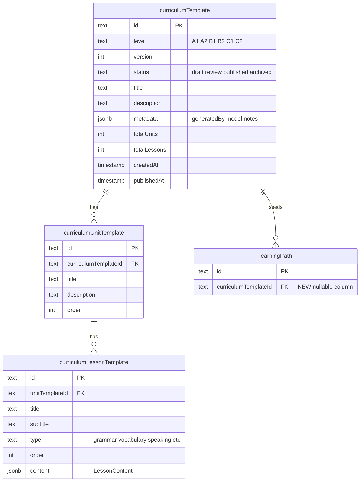
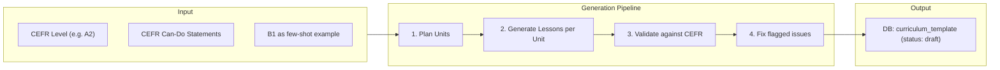

# Curriculum DB Storage with Versioning and Seed Pipeline

## 1. New Drizzle Schema: Curriculum Templates

Create a new schema file [packages/db/src/schema/curriculum.ts](packages/db/src/schema/curriculum.ts) with three tables that form the **template layer** above the existing user-facing tables.




Key design decisions:

- **Immutable versions**: once `status = "published"`, content is frozen; improvements become a new version
- **Unique constraint** on `(level, version)` to prevent duplicates
- `**metadata` JSONB** stores generation context: which model, prompt config, reviewer notes -- useful for tracing how content was produced
- Reuses the existing `LessonContent` interface from [packages/db/src/schema/content.ts](packages/db/src/schema/content.ts) for `curriculumLessonTemplate.content`, keeping the shape consistent

## 2. Add FK to Existing `learningPath`

Add a nullable `curriculumTemplateId` column to the `learningPath` table in [packages/db/src/schema/content.ts](packages/db/src/schema/content.ts):

```typescript
curriculumTemplateId: text("curriculum_template_id")
    .references(() => curriculumTemplate.id)
```

Nullable for backward compatibility -- existing learning paths won't have it set.

## 3. Export New Schema

Register the new schema in [packages/db/src/index.ts](packages/db/src/index.ts):

```typescript
export * from "./schema/curriculum";
```

Then run `pnpm db:push` from `packages/db` to sync to the database.

## 4. Migrate Existing B1 Content into DB

Create a one-time seed script at `packages/db/src/seed-curriculum.ts` that:

1. Imports `B1_CURRICULUM` from [apps/server/src/curriculum/b1.ts](apps/server/src/curriculum/b1.ts)
2. Inserts a `curriculumTemplate` row: `{ level: "B1", version: 1, status: "published" }`
3. Inserts `curriculumUnitTemplate` rows for each unit
4. Inserts `curriculumLessonTemplate` rows for each lesson with full `LessonContent`
5. Add a `db:seed` script to [packages/db/package.json](packages/db/package.json): `"db:seed": "tsx src/seed-curriculum.ts"`

This is a one-time migration. After running, `b1.ts` can be kept as reference or deleted.

## 5. Update `generateLearningPath` to Read from DB

Modify [apps/server/src/services/generate-learning-path.ts](apps/server/src/services/generate-learning-path.ts):

**Before** (current):

```typescript
const curriculum = getCurriculum(cefrLevel); // reads static B1_CURRICULUM
```

**After**:

```typescript
const template = await db
  .select()
  .from(curriculumTemplate)
  .where(
    and(
      eq(curriculumTemplate.level, cefrLevel),
      eq(curriculumTemplate.status, "published")
    )
  )
  .orderBy(desc(curriculumTemplate.version))
  .limit(1);
```

Then fetch unit templates + lesson templates from the DB and seed the user's `learning_path`, `unit`, and `lesson` rows as before. Store `curriculumTemplateId` on the new `learningPath` row.

Remove the static `CURRICULUM_MAP`, `getCurriculum()`, and the import of `B1_CURRICULUM`.

## 6. Curriculum Generation Script

Create `apps/server/src/scripts/generate-curriculum.ts` -- a standalone TypeScript script that uses GPT-4o to generate a full curriculum for a given CEFR level and writes it into the template tables as a **draft**.




Implementation details:

- **Step 1 -- Plan Units**: Prompt GPT-4o with CEFR descriptors for the target level. Use Zod structured output (`z.object({ units: z.array(unitSchema) })`) to get a list of unit titles, descriptions, and lesson count per unit. Feed the existing B1 structure as a few-shot example of format and style.
- **Step 2 -- Generate Lessons**: For each unit, prompt GPT-4o to generate lessons. Use Zod structured output matching `LessonContent` exactly (grammar points, words to learn, exercise types). Process units sequentially to maintain coherence, or batch 2-3 at a time.
- **Step 3 -- Validate**: A second LLM call reviews the full generated curriculum against CEFR level descriptors. Checks: difficulty appropriate for level, no duplicate topics across units, vocabulary count reasonable, grammar progression logical. Returns a list of flagged issues.
- **Step 4 -- Fix**: Re-generate only the flagged lessons with the feedback.
- **Write to DB**: Insert as `curriculumTemplate` with `status: "draft"`, plus all unit and lesson templates.

The script accepts CLI args:

```bash
tsx apps/server/src/scripts/generate-curriculum.ts --level A2
tsx apps/server/src/scripts/generate-curriculum.ts --level B2
```

Uses the existing `@ai-sdk/openai` and `ai` packages already in the server's dependencies. No new dependencies needed.

## 7. Publish/Manage Script

Create a small utility `apps/server/src/scripts/manage-curriculum.ts` for lifecycle operations:

```bash
# List all templates
tsx manage-curriculum.ts list

# Review a draft (prints summary)
tsx manage-curriculum.ts review --level A2 --version 1

# Publish a draft
tsx manage-curriculum.ts publish --level A2 --version 1

# Archive an old version
tsx manage-curriculum.ts archive --level B1 --version 1
```

This keeps management simple via CLI without building admin UI upfront. An admin UI can come later.

## File Changes Summary


| File                                                 | Change                                          |
| ---------------------------------------------------- | ----------------------------------------------- |
| `packages/db/src/schema/curriculum.ts`               | **NEW** -- 3 template tables                    |
| `packages/db/src/schema/content.ts`                  | Add `curriculumTemplateId` FK to `learningPath` |
| `packages/db/src/index.ts`                           | Export new schema                               |
| `packages/db/src/seed-curriculum.ts`                 | **NEW** -- one-time B1 migration script         |
| `packages/db/package.json`                           | Add `db:seed` script                            |
| `apps/server/src/services/generate-learning-path.ts` | Read from DB templates instead of TS file       |
| `apps/server/src/scripts/generate-curriculum.ts`     | **NEW** -- LLM generation pipeline              |
| `apps/server/src/scripts/manage-curriculum.ts`       | **NEW** -- CLI for publish/archive/list         |


